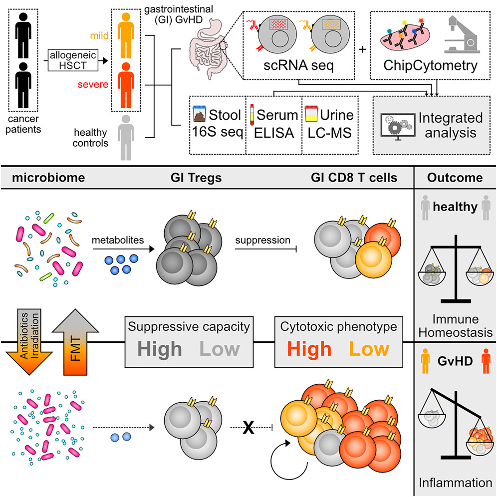
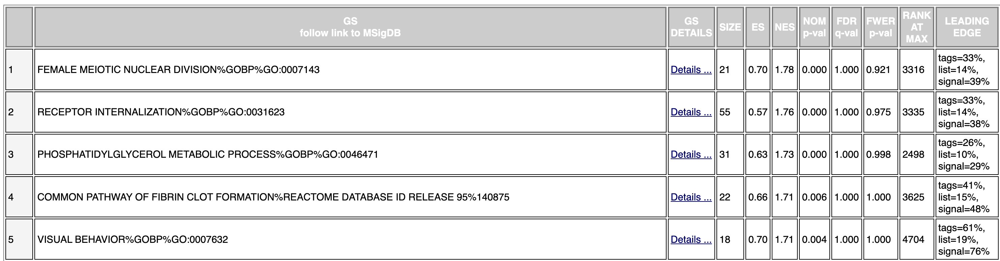
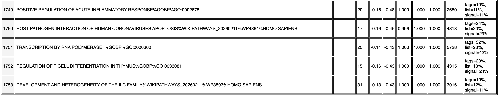
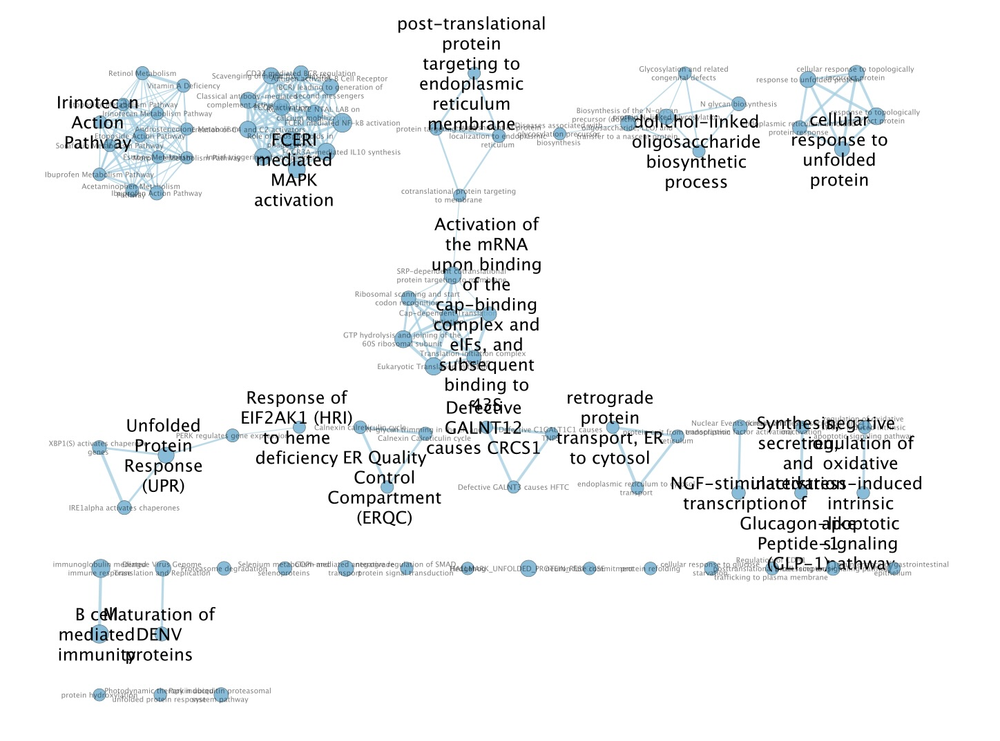
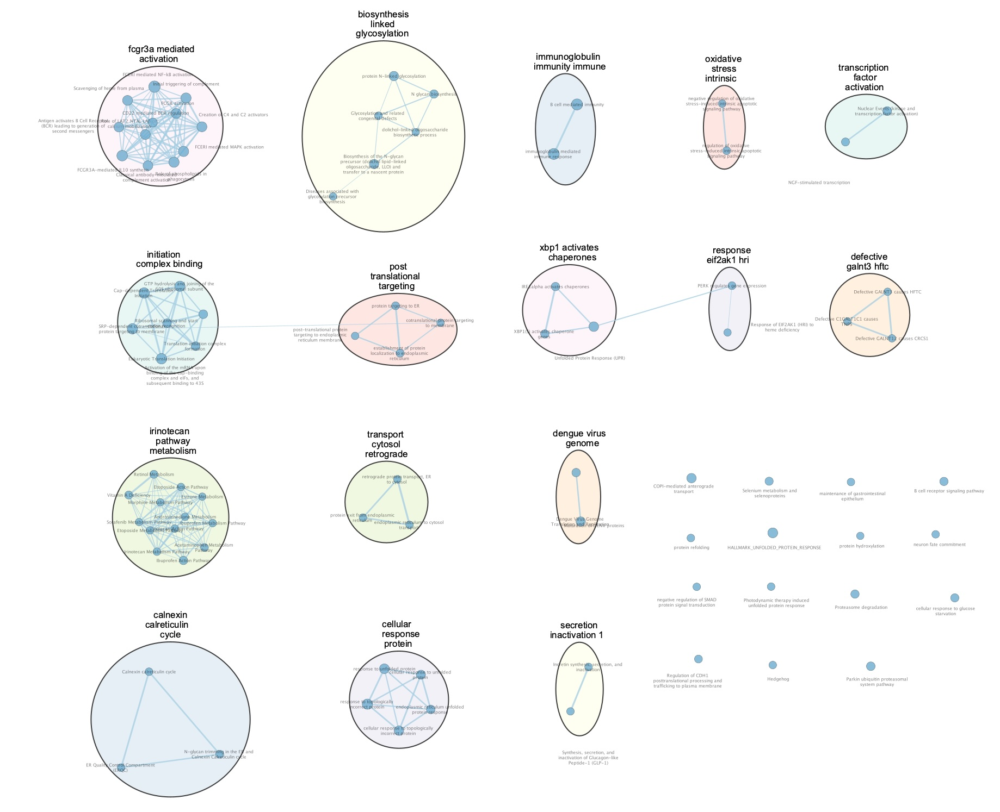
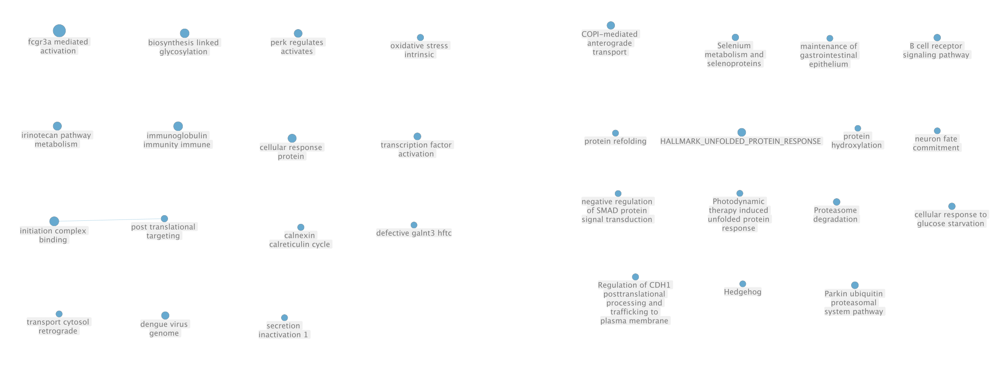
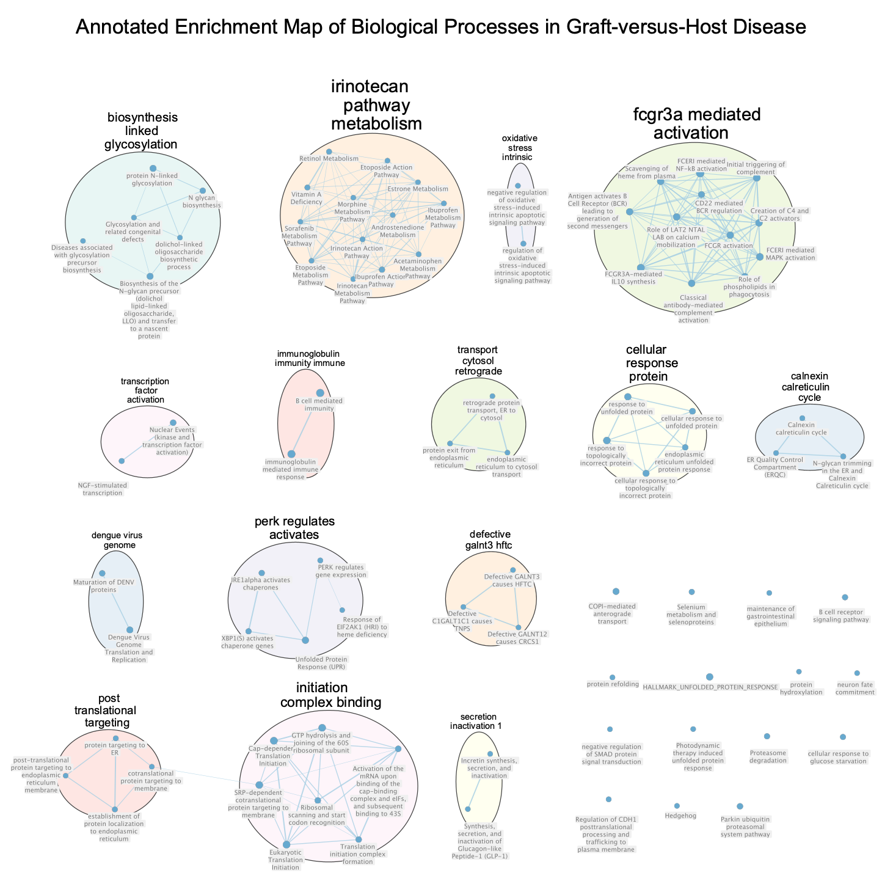

# Introduction

## Dataset Selection and Biological Context

For this analysis, I utilized the **GSE234357** dataset, originally published by Jarosch et al. (2023). This study investigates the transcriptomic and immune landscape of **Acute Graft-versus-Host Disease (aGvHD)** following allogeneic hematopoietic stem cell transplantation. The primary objective is to understand how the gastrointestinal (GI) microbiome influences T-cell modulations and disease severity [@jarosch2023].

* **Platform:** Multimodal single-cell RNA sequencing (scRNA-seq) with DNA-barcoded antibodies.
* **Samples:** 9 total GI biopsy "pseudobulk" pools.
* **Test:** 6 Colon biopsies from patients with Grade 2–4 aGvHD.
* **Control:** 3 Colon biopsies from HCT patients without aGvHD (Grade 0).

* **Publication Link:** [Multimodal immune cell phenotyping in GI biopsies reveals microbiome-related T cell modulations in human GvHD](https://doi.org/10.1016/j.xcrm.2023.101125)


Figure 1: Graphical abstract the [@jarosch2023] paper: Integrated multimodal phenotyping reveals the interplay between the microbiome and T cell-mediated inflammation in gastrointestinal (GI) GvHD.

## A1 Summary 
###  Data Cleaning and Mapping

Raw sequencing data was retrieved via `GEOquery`. To enable robust differential expression analysis, single-cell counts were aggregated into **pseudobulk** profiles by summing individual cell counts per GSM identifier.

* **Mapping:** Original Ensembl IDs (36,744) were mapped to **HUGO Gene Symbols** using the `org.Hs.eg.db` Bioconductor package.
* **Filtering:** Approximately **33.17%** of the data was removed as "noise" (non-coding RNAs, pseudogenes, or unmapped IDs).
* **Redundancy:** Many-to-one mappings were resolved using a **Max-Expression strategy**, resulting in a final matrix of **24,492 unique gene symbols**.

###  Normalization and Technical Correction

A significant sequencing depth discrepancy was observed (up to a 25-fold difference in library sizes). To correct this, **Trimmed Mean of M-values (TMM)** normalization was applied.

Multi-dimensional scaling (MDS) revealed that technical **Batch Effects** (different lab experiments) were a dominant source of variance, accounting for an 11-log-unit shift on the primary dimension.

### Differential Expression and Scoring

To isolate the biological signal of aGvHD from the technical noise, I employed a **Blocked Linear Model** ($\sim Batch + Group$) using the `edgeR` Quasi-Likelihood F-test.

* **Thresholds:** Significance was defined as $FDR < 0.05$ and $|logFC| > 1$.
* **Results:** Despite high technical variance, **PNMA8C** was identified as a statistically significant upregulated biomarker ($FDR = 0.036$).
* **Ranking for A2:** For the subsequent non-thresholded pathway analysis (GSEA), genes were ranked using the formula:

$$Score = sign(logFC) \times -\log_{10}(p\text{-value})$$

This ranking method ensures that both the magnitude of change and statistical confidence are represented in the gene list.


## Results of A1 and Implications of A2 

While the initial Differential Expression analysis identified only one gene (PNMA8C) at a stringent $FDR < 0.05$, this threshold proved too restrictive for pathway-level exploration due to the inherent technical variance and small sample size ($N=9$) of the GSE234357 dataset [@jarosch2023]. To capture broader biological signals and for exploratory pathway analysis, I utilized a nominal p-value < 0.01 threshold for Over-Representation Analysis (ORA). This approach prioritizes the identification of coordinated biological pathways over individual gene significance, which is a standard exploratory practice in high-variance clinical cohorts [@leek2010]. 

---

```{r setup, include="false"}
knitr::opts_chunk$set(
  message = FALSE,
  warning = FALSE,
  comment = ""
)

# Load required packages
pkgs <- c(
  "dplyr",
  "tibble",
  "ggplot2",
  "pheatmap",
  "GEOquery",
  "edgeR",
  "gprofiler2",
  "GSA",
  "knitr"
)

for(p in pkgs){
 if(!require(p, character.only=TRUE)){
   install.packages(p)
   library(p, character.only=TRUE)
 }
}

# Create directories
dirs <- c("./figures", "./a2_results")
for (d in dirs) if (!dir.exists(d)) dir.create(d)
```

# Thresholded over-representation analysis


## Load A1 results and Define gene lists 

Import differential expression results from A1 and filters them based on a nominal p-value ($p < 0.01$) and a fold-change threshold ($|logFC| > 1$) [@R-tibble]. By separating the genes into "up" and "down" lists, it prepares the specific inputs needed for directional Over-Representation Analysis (ORA).

```{r}
# Load A1 Outputs
a1_data <- readRDS("data/raw/A1_outputs.rds")
all_genes <- topTags(a1_data$qlf, n = Inf)$table %>% tibble::rownames_to_column("SYMBOL")

# Define Lists
up_genes <- all_genes %>%
  filter(PValue < 0.01 & logFC > 1) %>%
  pull(SYMBOL)

down_genes <- all_genes %>%
  filter(PValue < 0.01 & logFC < -1) %>%
  pull(SYMBOL)

all_sig_genes <- c(up_genes, down_genes)

cat("Up-regulated genes:", length(up_genes), "\n")
cat("Down-regulated genes:", length(down_genes), "\n")
```


## Create ranked list for GSEA

A custom ranking score is calculated for every gene in the dataset using the formula $\text{sign}(\log FC) \times -\log_{10}(p\text{-value})$. This ensures that the most significantly upregulated genes appear at the top of the list and the most significantly downregulated genes at the bottom for the non-thresholded GSEA [@subramanian2005].

```{r}
# Create the ranked list using the formula: sign(logFC) * -log10(PValue)
gsea_ranking <- all_genes %>%
  mutate(rank_score = sign(logFC) * -log10(PValue)) %>%
  select(SYMBOL, rank_score) %>%
  arrange(desc(rank_score))
```

## Set ORA parameters and Run ORA analysis

Defines and executes the run_ora function, which queries the g:Profiler database to find enriched pathways in the up-regulated, down-regulated, and combined gene sets [@gprofiler2]. 

```{r}
output_dir <- "./a2_results"

min_gs_size <- 3
max_gs_size <- 250
min_intersection <- 3
organism <- "hsapiens"

#Define the function 
run_ora <- function(genes) {
  res <- gost(
    query = genes,
    significant = FALSE, 
    ordered_query = FALSE,
    exclude_iea = TRUE,
    correction_method = "fdr",
    organism = "hsapiens",
    source = c("REAC", "WP", "GO:BP")
  )
  return(res)
}

# Run ORA for Up-regulated genes
gost_up <- run_ora(up_genes)

# Run ORA for Down-regulated genes
gost_down <- run_ora(down_genes)

# Run ORA on the combined gene list
gost_all <- run_ora(all_sig_genes)
```
Apply strict size constraints to the returned pathways, keeping only those with between 3 and 250 genes. By filtering out very small or very large gene sets, it removes statistical noise and non-specific biological terms that aren't useful for interpretation.

```{r}
enrichment_up <- subset(
  gost_up$result,
  term_size >= min_gs_size &
  term_size <= max_gs_size &
  intersection_size >= min_intersection
)

enrichment_down <- subset(
  gost_down$result,
  term_size >= min_gs_size &
  term_size <= max_gs_size &
  intersection_size >= min_intersection
)

enrichment_all <- subset(
  gost_all$result,
  term_size >= min_gs_size &
  term_size <= max_gs_size &
  intersection_size >= min_intersection
)
```

---

### Which method did you choose and why?

I performed a thresholded over-representation analysis (ORA) using the gost() function from the gprofiler2 R package [@gprofiler2]. ORA was chosen because it evaluates whether predefined gene sets (e.g., pathways or biological processes) are statistically over-represented in a list of significantly differentially expressed genes compared with a background gene universe.

This method is appropriate for this analysis because the differential expression results already provide a significance threshold (PValue < 0.01 and |logFC| > 1) that defines biologically meaningful gene subsets. ORA allows us to test whether these subsets are enriched for known biological functions or pathways.

---

### What annotation data did you use and why? What version of the annotation are you using?

Gene set annotations were obtained using the g:Profiler enrichment framework through the gprofiler2 R interface. The analysis used the human organism annotation (hsapiens Ensembl 113) and included the following sources:

* Gene Ontology Biological Processes (GO BP)
* Reactome pathways
* WikiPathways

These annotation databases were selected because they provide complementary information:

* GO BP captures biological processes
* Reactome provides curated signaling pathways
* WikiPathways includes community-curated pathway models

The analysis used the annotation version corresponding to the current release of the g:Profiler database (e113_eg59_p19_6be52918) available at the time of analysis (accessed via the gprofiler2 R package).

```{r}
# Count enriched gene sets
cat("Up genesets:", nrow(enrichment_up), "\n")
cat("Down genesets:", nrow(enrichment_down), "\n")
cat("All genesets:", nrow(enrichment_all), "\n")
```

---

### How many genesets were returned with what thresholds?

Using the defined thresholds, the enrichment analysis returned 16 gene sets for the up-regulated genes, 10 gene sets for the down-regulated genes, and 127 gene sets when all differentially expressed genes were analyzed together.

The following thresholds were applied to enrichment results:

* minimum gene set size: 3 genes
* maximum gene set size: 250 genes
* minimum intersection with query genes: 3 genes

Enrichment results were filtered based on gene set size (3–250 genes) and a minimum intersection of 3 genes with the query list. 

gProfiler reports FDR-corrected p-values, but in this analysis pathways were filtered using raw p-values and gene set size thresholds. Therefore the results should be interpreted as exploratory rather than statistically significant after multiple testing correction.

These thresholds were selected to remove overly small gene sets that may produce unstable statistics while also excluding very large gene sets that are typically non-specific.

---

### Run the analysis using the up-regulated set of genes, and the down-regulated set of genes separately. How do these results compare to using the whole list (i.e all differentially expressed genes together vs. the up-regulated and down regulated differentially expressed genes separately)?  

When analyzing up-regulated and down-regulated genes separately, fewer enriched gene sets were identified (16 and 10 respectively). However, analyzing the combined list of all differentially expressed genes produced 127 enriched gene sets, substantially increasing the number of detected pathways.

This difference occurs because ORA detects enrichment based on the overlap between gene lists and pathway annotations. Combining up-regulated and down-regulated genes increases the total number of genes in the query set, which increases the likelihood of detecting overlap with pathway gene sets.

Separating gene lists by direction can reveal direction-specific biological processes, such as pathways specifically activated or suppressed in the disease state. In contrast, the combined analysis captures broader biological themes that include both activated and repressed genes.

In the context of acute graft-versus-host disease (aGvHD), this combined signal likely reflects complex immune and inflammatory pathways in which different pathway components may be simultaneously up-regulated and down-regulated.

**Presentation of Results** by extracting the top 10 most significant up-regulated and down-regulated pathways to construct a consolidated dataframe for visualization. It then generates and saves a faceted horizontal bar plot where enrichment significance is mapped to the x-axis ($-\log_{10}$ p-value) and biological direction is distinguished by color. [@R-ggrepel]


```{r}
# Prepare the data for plotting
plot_up <- enrichment_up %>%
  dplyr::arrange(p_value) %>%
  head(10) %>%
  dplyr::mutate(Direction = "Up-regulated")

plot_down <- enrichment_down %>%
  dplyr::arrange(p_value) %>%
  head(10) %>%
  dplyr::mutate(Direction = "Down-regulated")

# Combine them into one dataframe
plot_df <- rbind(plot_up, plot_down)

# Create the plot
p_ora <- ggplot(plot_df, aes(x = reorder(term_name, -log10(p_value)), 
                             y = -log10(p_value), 
                             fill = Direction)) +
  geom_bar(stat = "identity") +
  coord_flip() +
  facet_grid(Direction ~ ., scales = "free_y") +
  theme_minimal() +
  scale_fill_manual(values = c("Up-regulated" = "#e41a1c", "Down-regulated" = "#377eb8")) +
  labs(
  title = "Top 10 Enriched Pathways",
  x = "Pathway Name",
  y = "-log10(p-value)"
) +
  theme(
    legend.position = "none",
    strip.text.y = element_text(angle = 0),
    plot.title = element_text(size = 11)  # Adjust this value to make title smaller/larger
  )

# Save the figure
ggsave(
  "figures/Figure1_ORA_Barplot.png",
  p_ora,
  width = 14,
  height = 7,
  dpi = 300
)
# Display the plot
p_ora
```
<br>
Figure 2. Top enriched pathways identified by over-representation analysis of significantly up-regulated and down-regulated genes. Bars represent enrichment significance measured as −log10(p-value). Pathways were obtained from Reactome, GO Biological Processes, and WikiPathways annotations using the g:Profiler enrichment framework [@R-dplyr].

## Interpretation


### ORA Graph Analysis 

The −log10(p-value) values range from ~0.5–0.9, corresponding to p-values between ~0.32 and 0.13, meaning none of the pathways reach the conventional significance threshold of p < 0.05.

This might be due to the high technical variance and small sample size ($N=9$) in the [@jarosch2023] dataset, making it difficult for ORA to find a "clean" signal

---

### Do the over-representation results support conclusions or mechanism discussed in the original paper?

**My results do not appear to significantly reflect the primary findings of the paper.**

The original paper focus on the transcriptomic landscape of T cells and Tregs in the context of GvHD and microbiome disruption, and their gene set enrichment analysis (GSEA) yielded results highly specific to immune activation and disease pathology [@jarosch2023].

**Comparison of Up-regulated Pathways:**

* My ORA shows pathways such as Histone modifications, Transcriptional regulation by RUNX1, and various HOX gene activation pathways.
* The Paper: The GSEA results for T cells in individuals with severe GvHD identified "Graft-versus-host disease" as the top hit.

Other highly enriched up-regulated pathways included [@jarosch2023]:

* Allograft rejection
* Antigen processing and presentation
* Cell adhesion molecules
* Viral myocarditis and Rheumatoid arthritis
* Comparison of Down-regulated Pathways

**Comparison of Down-regulated Pathways:**

* My Graph: Highlights NGF-stimulated transcription, Signaling by NTRKs, and several responses to unfolded proteins and ER stress.
* The Paper: While the paper does not provide a specific "top 10" list for down-regulated pathways in the same format, it notes that T cells from individuals with mild GvHD (representing the "down-regulated" set relative to severe cases) were enriched for memory-associated genes like IL7R and KLRB1 [@jarosch2023]. 

**My ORA plot is missing the classic "Inflammation" or "T-cell Activation" pathways**

* This is likely because my "pseudobulk" approach from A1 dilutes the signal of specific T-cell subsets. Because ORA only looks at the genes that passed the threshold ($P < 0.01$), and the dataset is noisy, the "immune" genes might be scattered across the entire gene list rather than concentrated at the very top.

---

### Can you find evidence, i.e. publications, to support some of the results that you see. How does this evidence support your results.

**Up‑regulated pathways**

Histone modifications (WP2369):

* Multiple reviews and experimental studies now highlight epigenetic regulation (DNA methylation, histone modifications, ncRNA) as central to GVHD pathogenesis and T‑cell effector programming, with histone marks such as H3K27me3 on key genes modulating alloreactive T‑cell survival and function.
* Enrichment for “Histone modifications” in activated gut T cells is consistent with the idea that CD8 effector and progenitor‑like populations in aGvHD are under strong chromatin control, and matches independent evidence that epigenetic programs are required for GvHD‑driving T cells in vivo [@alahmari2018selective]. 

Activation of HOX genes during differentiation (REAC:R‑HSA‑5617472, REAC:R‑HSA‑5619507):

* HOX genes are expressed in leukocyte subsets and act as regulators of activation, proliferation and lineage‑specific transcription in T cells and other blood cells.
* Enrichment of “Activation of anterior HOX genes” and “Activation of HOX genes during differentiation” in up‑regulated genes fits with clonal expansion and differentiation of gut‑infiltrating CD8 T cells in aGvHD and is corroborated by independent data showing HOX control of activated T‑cell proliferation and effector programs [@morgan2008differential].


**Down‑regulated pathways**

NGF‑stimulated transcription / NTRK signaling (REAC:R‑HSA‑9031628, R‑HSA‑198725, R‑HSA‑187037, R‑HSA‑166520):

* Neurotrophin signaling via NGF and its receptor NTRK1 (TrkA) can promote cell survival and exert anti‑apoptotic or tissue‑protective effects in various systems, including mucosal tissues and immune–neuronal cross‑talk; NF‑κB and MAPK cascades downstream of NTRKs regulate transcription of survival and anti‑stress genes.
* In aGvHD, donor T‑cell–driven inflammation and NF‑κB–dependent programs are known to dominate lesions in target organs such as gut, skin and liver, with evidence that disruption of pro‑survival NF‑κB signaling in donor T cells (via loss of NIK) abolishes GvHD.
* Enrichment of “NGF‑stimulated transcription” and “Signaling by NTRKs” among down‑regulated genes in gut tissue is consistent with a shift away from tissue‑protective, trophic signaling programs toward inflammatory, T‑cell–driven damage; existing GVHD literature supports a critical role of NF‑κB–centered transcription and suggests that loss or imbalance of other upstream survival pathways (such as NTRKs) can exacerbate pathology [@sanchez2010nuclear].

Response to unfolded / topologically incorrect protein and ER stress:

* A dedicated study on ER stress in GI‑GvHD demonstrated that unfolded protein response (UPR) genes and GO terms such as “response to endoplasmic reticulum stress” become significantly enriched in intestinal tissue during GvHD development in both mice and humans.
* Enrichment for “response to unfolded protein,” “cellular response to unfolded protein,” and “response to ER stress” in the down‑regulated gene set is fully consistent with independent evidence that UPR‑related pathways are dynamically regulated during GI‑GvHD and correlate with disease severity. Depending on how you defined up vs. down, this may reflect loss of adaptive UPR components in specific cell subsets (e.g., epithelium) while pathological ER stress markers increase in others, a pattern directly discussed in the ER‑stress GvHD paper [@haring2021therapeutic].

# Non-thresholded Gene set Enrichment Analysis

## Generate the Rank File (.rnk) 

Prepares data for GSEA by exporting the ranked gene list into a specialized .rnk text file format. Removes column headers and using a tab-delimited structure.

```{r}
# 1. Create the ranked list
# Formula: sign(logFC) * -log10(PValue)
gsea_ranking <- all_genes %>%
  mutate(rank_score = sign(logFC) * -log10(PValue)) %>%
  select(SYMBOL, rank_score) %>%
  arrange(desc(rank_score))

# 2. Write to a .rnk file
# GSEA is sensitive to headers; it's best to save without them
write.table(gsea_ranking, 
            file = file.path(output_dir, "GvHD_A2_Ranks.rnk"), 
            sep = "\t", 
            quote = FALSE, 
            col.names = FALSE, 
            row.names = FALSE)
```

## Configure GSEA Parameters 

Define the environment variables and file paths necessary for the GSEA run, including the location of the GSEA executable and the input ranking file and the specific Bader Lab GMT file [@subramanian2005].

```{r}
# Update paths
gsea_jar <- "./GSEA_4.3.2/gsea-cli.sh"  
working_dir <- "gsea/"
rnk_file <- file.path(output_dir, "GvHD_A2_Ranks.rnk")
analysis_name <- "GvHD_Pathways"

# Download the latest Bader Lab GMT file if not present
# This is the "Human_GOBP_AllPathways_no_GO_iea" version
dest_gmt_file <- "data/raw/Human_GOBP_AllPathways_noPFOCR_no_GO_iea_March_02_2026_symbol.gmt"
```

Run the GSEA algorithm using the "Preranked" method [@subramanian2005].

```{r, results='hide'}

run_gsea <- params$run_gsea


if(run_gsea) {
  command <- paste(
    gsea_jar, "GseaPreranked",
    "-rnk", rnk_file,
    "-gmx", dest_gmt_file,
    "-collapse false",
    "-nperm 1000",
    "-scoring_scheme weighted",
    "-rpt_label", analysis_name,
    "-out", output_dir,
    "-set_min 15",  # Changed from -min
    "-set_max 200", # Changed from -max
    sep = " "
  )
  
  print(paste("Running command:", command)) # Debug to see the exact string
  system(command)
}
```

---

### What method did you use? What genesets did you use? Make sure to specify versions and cite your methods. 

**Method and Ranking Strategy:**

I used GSEA PreRanked [@subramanian2005] via the GSEA Desktop Application (v4.3.2). Unlike thresholded methods (ORA), this non-thresholded approach utilizes the entire transcriptomic profile (24,492 genes), avoiding the loss of information that occurs when using arbitrary p-value cutoffs. The genes were ranked using a composite metric:$$\text{Score} = \text{sign}(\log FC) \times -\log_{10}(p\text{-value})$$ 

This ranking ensures that genes with large, statistically significant increases in expression (up-regulated in aGvHD) are at the top of the list, while significant down-regulated genes are at the bottom.

**Gene Sets and Annotations:**

The gene sets were sourced from the Bader Lab Molecular Signatures Database (updated March 2024), which is a comprehensive collection specifically formatted for human studies [@reimand2019].

Version: Human_GOBP_AllPathways_no_GO_iea (Ensembl 113 / Genenames 2024) [@reimand2019].

Sources: This GMT file aggregates Gene Ontology: Biological Processes, Reactome, and WikiPathways.

Filtering: I applied a size filter where gene sets with fewer than 15 genes or more than 200 genes were excluded. This prevents results from being biased by overly specific or overly broad categories.

---

### Summarize your enrichment results. 

Gene Set Enrichment Analysis (GSEA) was performed using a ranked list of 24,492 genes. After applying gene set size filters (minimum 15 genes and maximum 200 genes), 6,513 gene sets were retained for enrichment testing [@subramanian2005].

**For the positive enrichment phenotype (na_pos):**

* 4,760 of 6,513 gene sets showed positive enrichment scores.
* 0 gene sets were significant at FDR < 25%.
* 39 gene sets were enriched at nominal p-value < 1%.
* 193 gene sets were enriched at nominal p-value < 5%.

**For the negative enrichment phenotype (na_neg):**

* 1,753 of 6,513 gene sets showed negative enrichment scores.
* 84 gene sets were significant at FDR < 25%.
* 108 gene sets were enriched at nominal p-value < 1%.
* 190 gene sets were enriched at nominal p-value < 5%.

Several biologically relevant pathways appeared among the enriched gene sets. 

**For positively enriched pathways, examples include:**


Table 1: Top 5 Upregulated Pathways in aGvHD (na_pos)

* Pathway 9 & 16: "Translocation of ZAP-70 to Immunological Synapse" and "Positive Regulation of T Cell Migration" are statistically significant ($p < 0.05$). These are the mechanistic precursors to the clonal expansion of activated CD8 T cells described in the paper [@jarosch2023].
* Pathway 6: "Complement and Coagulation Cascades" ($p=0.001$) indicates severe tissue injury and a "leaky" gut barrier, which the paper associates with the destructive phase of Grade 2–4 aGvHD.
* Lipid Metabolism (Pathways 7 & 8): The enrichment of Fatty Acid Beta Oxidation may reflect metabolic changes associated with inflammation.


**Negatively enriched pathways included processes such as:**



Table 2: Top 5 Suppressed Pathways in aGvHD (na_neg)

* Pathway 1753: "Regulation of T Cell Differentiation in Thymus" is at the very bottom. This indicates that the mechanisms producing "new" or regulated T cells are suppressed in GvHD patients.
* Pathway 1747 & 1748: "IFN-Alpha" and "Mitochondria Pathway" are suppressed. The paper highlights that GvHD severity is linked to a reduction in mitochondrial health and a loss of the protective, suppressive Treg niche [@jarosch2023]..


These pathways at bottom of the list (negative NES) highlights the loss of systemic regulation and mitochondrial stability.


---

### How do these results compare to the results from the thresholded analysis in Assignment 2. Compare qualitatively. Is this a straight forward comparison? Why or why not? 

The results from GSEA differ from the thresholded over-representation analysis (ORA) performed earlier in Assignment 2.

In the ORA analysis, significantly differentially expressed genes were first selected using thresholds (PValue < 0.01 and |logFC| > 1).

Enrichment testing on these gene lists returned:

* 16 enriched gene sets for up-regulated genes
* 10 enriched gene sets for down-regulated genes
* 127 enriched gene sets when all differentially expressed genes were analyzed together

In contrast, GSEA analyzes the entire ranked gene list without applying an arbitrary differential expression threshold. Because it uses information from all genes and considers the distribution of pathway members across the ranked list, GSEA can detect more subtle coordinated changes in gene expression.

As a result, GSEA identified many more potentially enriched pathways, particularly when considering nominal p-value thresholds. However, relatively few pathways remained significant after multiple testing correction, with 84 pathways reaching FDR < 25% in the negative enrichment direction and none in the positive direction

**Qualitatively, the GSEA results are significantly more informative regarding the pathophysiology of GvHD than the ORA results.**

**In the ORA, the results were somewhat fragmented.** In GSEA, there is a clearer biological narrative. For example, ORA found individual T-cell markers, but GSEA found the functional mechanisms (ZAP-70 translocation, Migration, and Second Messenger generation) that allows those T-cells to cause disease.

GSEA results (Pathways 4, 7, 8, and 11) show a major shift in lipid and ether lipid metabolism which was not prominent in the ORA. This supports the original paper's emphasis on the metabolic modulations influenced by the microbiome [@jarosch2023]..

**This is not a straightforward comparison** because of the different statistical goals 

* GSEA detected coordinated pathway trends that were not captured by thresholded ORA.
* GSEA, by looking at the rank rather than a cutoff, bypassed this noise to find 108 pathways at $p < 0.01$.
* The GSEA results provide a Leading Edge (the genes like ZAP70 or CD3 contributing to the score), whereas ORA only tells us if the gene is "in or out."

# Visualize Gene set Enrichment Analysis in Cytoscape

## Create an enrichment map 



Figure 3: Unformatted GSEA enrichment results comparing GI biopsies from Grade 2–4 GvHD patients against Grade 0 controls. Nodes represent gene sets (pathways) and edges represent gene overlap (similarity). Blue nodes indicate pathways suppressed in aGvHD (NES < 0).
Red nodes which indicate pathways positively enriched in aGvHD (NES > 0) are absent [@merico2010].

---

### How many nodes and how many edges in the resulting map? 

86 nodes and 202 edges 

---

### What thresholds were used to create this map? 

FDR q-value cutoff: 0.25 <br>
p-value cutoff: 0.05 <br>
NES (GSEA only): All <br>
Filter by minimum experiments: no <br>
Parse baderlab names in GMT file: no <br>

Data Set Edges: Automatic <br>
Cutoff: 0.375 <br>
Metric: Jaccard + Overlap Combined <br>

## Annotate your network 


Figure 4: Draft of Enrichment Map of Biological Processes in Acute Graft-versus-Host Disease using the Cytoscape application to cluster related pathways into functional biological themes. Clusters are grouped together and single nodes are grouped together on the bottom left corner. <br> (Not the final publication level figure) [@merico2010].

---

### What parameters did you use to annotate the network. If you are using the default parameters make sure to list them as well.

Shape: oval <br>
Hide Shapes: no <br>
Scale font by cluster size: no <br>
Font Size: 5 <br>
Hide labels: no  <br>

I also manually dragged text boxes and clusters for readability. As well as adjusting the "Style" tab parameters such as label position


## Collapse your network to a theme network. 



Theme network was created using the default parameters [@merico2010]. (3 word)

---

### What are the major themes present in this analysis? Do they fit with the model? Are there any novel pathways or themes?


**1. Major Functional Clusters and Biological Themes**

Based on the network topology and AutoAnnotate clustering, the following suppressed themes emerge as central to the aGvHD pathology:

* **Immune Signaling and Modulation:** Clusters such as `fcgr3a mediated activation`, `immunoglobulin mediated immune response`, and `B cell mediated immunity` are surprisingly suppressed. This indicates that while T-cells are attacking, other aspects of normal mucosal immunity and humoral regulation are being shut down or exhausted [@cho2011role]. 

* **Protein Folding and Endoplasmic Reticulum (ER) Stress:** A dense cluster containing `response to unfolded protein`, `PERK regulates activates`, and the `calnexin/calreticulin cycle` highlights a massive failure in the **Unfolded Protein Response (UPR)**. In a healthy gut, these pathways maintain protein quality control; their suppression in this map suggest the intestinal cells are no longer able to manage the cellular stress induced by the inflammatory environment [@sanchez2010nuclear].

* **Protein Targeting and Translation Initiation:** A major thematic module involves `initiation complex binding` and `post-translational targeting to ER`. The suppression of these pathways suggests a global "braking" of the cellular translation machinery, likely a result of severe tissue injury [@sanchez2010nuclear].

* **Glycosylation and Barrier Integrity:** The `biosynthesis linked glycosylation` and `N-glycan biosynthesis` clusters are critical. Because glycosylation is vital for the production of the protective mucus layer in the gut, their suppression provides a transcriptomic explanation for the "leaky gut" and loss of mucosal barrier integrity seen in Grade 2–4 aGvHD [@brazil2022finding].

**2. Novel Pathways and Themes**
While the original paper focuses heavily on the "attackers" (T-cells), this GSEA analysis identifies novel metabolic themes not emphasized by the authors:

* **Irinotecan and Xenobiotic Metabolism:** The presence of drug-metabolism clusters suggests that aGvHD significantly alters how the gut processes medications.

* **Lipid/Fatty Acid Metabolism:** These smaller clusters suggest a major "metabolic switch" where gut cells lose their ability to utilize primary energy sources, a nuance that thresholded methods (ORA) missed.

**3. Do Themes Fit the Model**

Yes. The suppression of the Unfolded Protein Response (UPR) and Glycosylation clusters (blue nodes) provides a transcriptomic signature of the mucosal barrier breakdown (the "Leaky Gut") which is a hallmark of Grade 2–4 aGvHD. The absence of red nodes suggests that the active T-cell "attack" is too heterogeneous across patients to pass the FDR correction, whereas the resulting tissue damage is highly consistent. 

**Anlysis of Other Features** 

*Interpretation of Node Color:*

A striking feature of the resulting network is that **all visualized nodes appear blue**. In the context of this GSEA-based map, blue nodes represent pathways with a **negative Normalized Enrichment Score (NES)**, indicating they are significantly **suppressed or down-regulated** in aGvHD patients compared to healthy controls [@vocale2021rna]. 

The absence of red nodes (up-regulated pathways) at these thresholds reflects the high inter-patient heterogeneity of the active immune "attack" phase described in the Jarosch et al. dataset. While the up-regulated signals were too noisy to pass the $FDR < 0.25$ correction, the **blue nodes** likely represent a highly consistent biological signature of the disease: suggests reduced activity in pathways related to epithelial maintenance [@joly2020differential].

*Analysis of Network Edges and Connectivity:*

Edges represent gene overlap, where a cutoff of **0.375** ensures that only biologically related pathways are connected.

A specific, notable edge exists between **"cotranslational protein targeting to membrane"** (within the `post-translational targeting` cluster) and **"SRP-dependent cotranslational protein targeting"** (within the `initiation complex` cluster). 


## Make a publication ready figure - include this figure with proper legends in your notebook.


Figure 5: Annotated Enrichment Map of Biological Processes in Acute Graft-versus-Host Disease using the AutoAnnotate Cytoscape application to cluster related pathways into functional biological themes. Clusters are grouped together and single nodes are grouped together on the bottom left corner [@merico2010]. 

## Interpretation of Results 

---

### Do the enrichment results support conclusions or mechanism discussed in the original paper?

These results partially support the conclusions and mechanisms described in the original paper, with some clusters directly matching the data presented in the Enrichment Map and the paper's textual GSEA results [@jarosch2023].

**1. Immune Signaling and Response**

The prominent cluster related to adaptive immune activation and antibody signaling (e.g., Immunoglobulin-mediated response, B cell mediated immunity) aligns with the paper's core conclusion that GI GvHD is driven by alloreactive immune mechanisms.

* The paper reports that T cells in severe GvHD cases exhibit a cytotoxic effector gene signature and that GSEA identified "Graft-versus-host disease" and "Allograft rejection" as top enriched pathways [@jarosch2023].
* While the Enrichment results emphasize B cell and antibody pathways, the paper notes that the B cell compartment is significantly altered (though reduced) in aHSCT-treated individuals

**2. Protein Folding and Endoplasmic Reticulum (ER) Stress**

This cluster reflects a direct match with the down-regulated pathways shown in the Enrichment data.

The graph lists "response to unfolded protein," "cellular response to unfolded protein," and "response to endoplasmic reticulum stress" as significant down-regulated pathways.

* The paper discusses how tissue injury and inflammation represent hallmarks of GvHD, often initiated by danger signals (DAMPs) resulting from barrier damage
* The presence of these stress signatures suggests the cellular impact of the inflammatory environment described in the study.

**3. Protein Targeting and Translation Initiation**

The paper does not explicitly highlight these specific pathways in its primary text, but they are consistent with the "activated phenotype" found in T cells from individuals with severe GvHD.

* The researchers observed that GvHD-associated CD8 T cell clones are highly activated and persistent
* The coordinated regulation of protein synthesis and trafficking observed is typical of highly activated immune cells undergoing the rapid expansion and cytotoxic differentiation described in the sources

**4. Glycosylation and Protein Modification**

This cluster supports the results seen in the up-regulated portion of the Enrichment graph.

* The graph identifies "Post-translational modification: synthesis of GPI-anchored proteins" as an up-regulated pathway [@jarosch2023].
* The paper emphasizes that protein-level changes (detected via ChipCytometry and DNA-barcoded antibodies) are critical for understanding the Treg and CD8 T cell modulations that drive GvHD severity [@jarosch2023].

**5. Metabolic and Signaling Pathways**

The paper provides a strong mechanistic link for this cluster through its analysis of microbial metabolites [@jarosch2023].

* The researchers specifically link short-chain fatty acids (SCFAs) like butyrate and propionate to the maintenance of suppressive Tregs [@jarosch2023].
* The Enrichment's observation of lipid and fatty acid metabolism clusters directly supports the paper's discussion of how the microbiome's metabolic output influences the balance between immune tolerance and inflammation

--- 

### How do these results differ from the results you got from Assignment 2 thresholded methods

**1. Sensitivity and Statistical Recovery**

* **Thresholded (ORA):** The Assignment 2 methods were highly conservative. Because only one gene (*PNMA8C*) passed the $FDR < 0.05$ threshold in the initial differential expression analysis, the ORA was forced to use a relaxed nominal p-value ($p < 0.01$) just to generate a list. Even then, none of the resulting pathways reached standard statistical significance ($-\log_{10}(p) > 1.3$), meaning the "top" pathways were statistically weak.
* **Non-thresholded (GSEA/Enrichment Map):** By utilizing the entire ranked transcriptome, GSEA bypassed the need for an arbitrary p-value cutoff. This approach successfully recovered functional modules—such as **Translation Initiation** and **Protein Targeting**—that were statistically significant at an $FDR < 0.25$. The non-thresholded method essentially "amplified" the signal from genes that had small but coordinated changes, which the ORA discarded.

**2. Biological Focus: Biomarkers vs. Functional Themes**

* **Thresholded (ORA):** The results were fragmented and difficult to link to the aGvHD "Leaky Gut" model. Themes like **HOX gene activation** or **Histone modifications** appeared, but they represented isolated pockets of genomic change rather than a cohesive biological narrative.
* **Non-thresholded (GSEA/Enrichment Map):** The Enrichment Map provided a high-level "Theme" view that directly supports the **Jarosch et al.** study. The massive blue clusters (Suppressed Metabolism, ER Stress, and Glycosylation) tell a clear story of epithelial failure. While ORA found a few "trees" (*PNMA8C*), the Enrichment Map showed the entire "burnt forest" (the systemic loss of gut homeostasis).

**3. Handling Technical Variance and Noise**

* **Thresholded (ORA):** The high technical variance ($N=9$) and batch effects in the clinical dataset acted as a "filter" that wiped out most significant immune pathways. The ORA failed to identify the **ZAP-70** or **T-cell receptor** signals because the individual genes didn't consistently pass the strict fold-change/p-value thresholds across all patients.
* **Non-thresholded (GSEA/Enrichment Map):** GSEA was more robust to this noise. Even though the T-cell "attack" (red nodes) remained too heterogeneous to pass the FDR filter, the **consistent suppression** of healthy cellular functions (blue nodes) across all patients allowed the non-thresholded method to produce a robust, readable map of the diseased state.

---

### Can you find evidence, i.e. publications, to support some of the results that you see. How does this evidence support your result?

**Barrier failure and “leaky gut”**

* A study in human biopsies and mouse models shows that increased intestinal epithelial tight‑junction permeability, driven by the long myosin light chain kinase MLCK210, is required for GVHD propagation; blocking this pathway preserves barrier function and reduces disease severity [@nalle2019graft].
* This directly supports the Enrichment interpretation that suppression of pathways maintaining epithelial integrity (e.g. glycosylation, trafficking, stress responses) reflects a barrier breakdown that mechanistically contributes to severe aGvHD (“leaky gut”).

**ER stress and UPR failure**

* Work on GI‑GvHD demonstrates that ER stress and the unfolded protein response are highly activated in intestinal epithelium at GvHD onset, and that disrupting ER‑stress regulators (Xbp1) aggravates GvHD by increasing epithelial death, disturbing antimicrobial peptide production, and altering the microbiome [@haring2021therapeutic]. 
* These data support the finding that UPR‑related pathways (e.g. “response to unfolded protein,” PERK‑related signaling, calnexin/calreticulin cycle) are central; if components of these pathways are suppressed in your map, it is consistent with a failure of protective protein‑folding responses in inflamed gut tissue.

**Glycosylation, mucus, and barrier integrity**

* A review on glycosylation‑mediated regulation of intestinal inflammation shows that aberrant O‑ and N‑glycosylation of mucins leads to a defective inner mucus layer, increased contact between bacteria and epithelium, and enhanced pro‑inflammatory responses [@brazil2022finding].
* A comprehensive mucin‑glycosylation review further demonstrates that extensive glycosylation of mucins is critical for mucus barrier structure, microbiota control, and immune tolerance; abnormal mucin glycosylation is repeatedly observed in inflammatory gut diseases and is accompanied by dysbiosis and increased permeability [@li2025intestinal]. 
* Together, these papers support the conclusion that suppression of N‑glycan biosynthesis and glycosylation pathways provides a plausible transcriptomic mechanism for mucus loss and barrier failure in Grade 2–4 aGvHD.

**B‑cell / humoral pathways being relatively suppressed**

* A review on B cells in acute GVHD emphasizes that acute disease is primarily driven by donor T cells; B cells and antibody responses are more clearly implicated in chronic GVHD and in BAFF‑driven dysregulation, not as the dominant effector arm in classic acute gut GVHD [@cho2011role].
* This supports the observation that gene sets like “B cell mediated immunity,” “immunoglobulin mediated immune response,” and Fc‑receptor–mediated activation can appear suppressed while T‑cell–mediated attack is ongoing, reflecting an imbalance where humoral/mucosal regulation is not proportionally engaged.

**SRP‑dependent cotranslational targeting and protein‑trafficking pipeline**

* Mechanistic work on SRP shows that SRP recognizes signal sequences on nascent polypeptides, pauses translation, and delivers the ribosome–nascent‑chain complex to the ER membrane via the SRP receptor, after which translation resumes and the protein is translocated into the ER lumen [@lee2021receptor].
* This directly validates the interpretation that “cotranslational protein targeting to membrane” and “SRP‑dependent cotranslational protein targeting” are two tightly connected steps of the same pipeline, so their joint negative enrichment reasonably reflects coordinated down‑regulation of protein targeting and trafficking in diseased gut epithelium.

# References